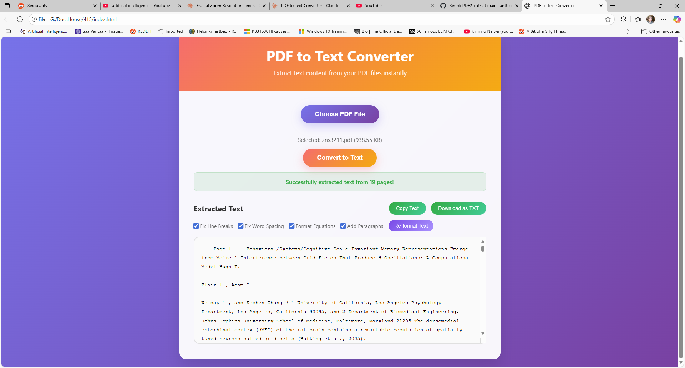

# PDF to Text Converter

Live at: 

https://anttiluode.github.io/SimplePDF2Text/

Convert PDF files to formatted text directly in your browser.

## How to Use

1. Save the HTML file to your computer
2. Open it in any web browser
3. Upload a PDF file or drag & drop it
4. Click "Convert to Text"
5. Copy or download the extracted text

## Features

- ✅ Works offline - no internet needed after loading
- ✅ No file uploads to servers - completely private
- ✅ Smart text formatting for better readability
- ✅ Handles mathematical equations and scientific papers
- ✅ Copy to clipboard or download as .txt file
- ✅ Mobile and desktop friendly

## Text Formatting Options

- **Fix Line Breaks** - Reconnects broken sentences
- **Fix Word Spacing** - Removes extra spaces
- **Format Equations** - Better math formatting
- **Add Paragraphs** - Intelligent paragraph breaks

## Requirements

- Modern web browser (Chrome, Firefox, Safari, Edge)
- JavaScript enabled

## Privacy

Your PDF files are processed entirely in your browser. No data is sent to any server.

## License

Free to use and modify.
